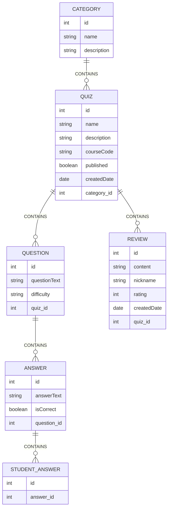

# Quiz Application AN3Ts

## Team Members

- [Anh Tran](https://github.com/AnnieTran2023)
- [Le Do](https://github.com/DozyXYZ)
- [Trang Le](https://github.com/TrangLe265)
- [Tuong Nguyen](https://github.com/NguyenTuong4017)

## Project Backlog

[Link to Project Backlog](https://github.com/orgs/AN3Ts/projects/1)

## Retrospective

- [Sprint 1](https://edu.flinga.fi/s/EH4Y23J)
- [Sprint 2](https://edu.flinga.fi/s/EY8K7BT)

## Deployment

The teachers' view is deployed and accessible at:  
[Teacher Application](https://quiz-git-quiz.2.rahtiapp.fi/quizzes/showQuizzes)

The students' view is deployed and accessible at:  
[Student Application](https://quiz-zfde.onrender.com/)

## API Documentation

The Swagger UI for the API documentation is available at:  
[Swagger UI](https://quiz-git-quiz.2.rahtiapp.fi/swagger-ui/index.html)

---

## Teacher Dashboard Features

### Quiz Management

- Add quizzes with:
  - **Name** (e.g., “The Scrum framework”).
  - **Description**.
  - **Course code**.
  - **Published status** (controls student access).
- View a list of quizzes.
- Edit and delete quizzes.

### Question Management

- Add multiple-choice questions to a quiz.
- Each question has:
  - **Content** (e.g., “What is the purpose of the Retrospective event?”).
  - **Difficulty level** (Easy, Normal, Hard).
- View a list of questions for a quiz.
- Delete questions.

### Answer Option Management

- Add multiple answer options per question.
- Each answer option has:
  - **Content** (e.g., “Finding ways to improve the process”).
  - **Correctness status** (indicating if it's correct).
- View a list of answer options for a question.
- Delete answer options.

### Category Management

- Add quiz categories (e.g., “Agile”, “Databases”).
- Each category has:
  - **Name**.
  - **Description**.
- Assign a category to a quiz.
- View a list of categories.
- Delete categories.

---

## Student Dashboard Features

### Taking Quizzes

- View a list of published quizzes.
- Take a quiz by answering multiple-choice questions.
- Get immediate feedback after answering a question (correct or incorrect).

### Viewing Results

- View quiz results including:
  - **Total number of answers**.
  - **Correct answer percentage**.
  - **Number of correct/wrong answers per question**.

### Quiz Reviews

- Write a review for a quiz.
- View reviews from other students.
- Edit and delete own reviews.

---

## Data Model



---

## Developer Guide

### Starting the Frontend Application

To start the frontend application locally, follow these steps:

1. **Navigate to the frontend directory:**

   ```bash
   cd quiz-student-view
   ```

2. **Install dependencies:**
   Ensure you have Node.js and npm installed. Then, run:

   ```bash
   npm install
   ```

3. **Start the development server:**

   ```bash
   npm run dev
   ```

4. **Access the application:**
   Open your browser and navigate to:

   ```
   http://localhost:5173
   ```

   The frontend application should now be running locally.

---

### Running Tests

To run the backend tests locally, follow these steps:

1. **Navigate to the project root directory:**

   ```bash
   cd ../quizz
   ```

2. **Run the tests using Maven:**

   ```bash
   ./mvnw test
   ```

3. **View the test results:**

   - The test results will be displayed in the terminal.
   - Detailed reports can be found in the `target/surefire-reports` directory.

4. **Debugging Tests:**
   - If a test fails, re-run Maven with debug logging enabled:
     ```bash
     ./mvnw test -X
     ```

## License

Quizzer is [MIT Licensed](https://github.com/AN3Ts/quiz/blob/main/LICENSE)!
